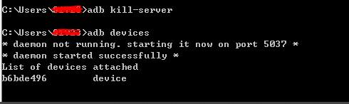
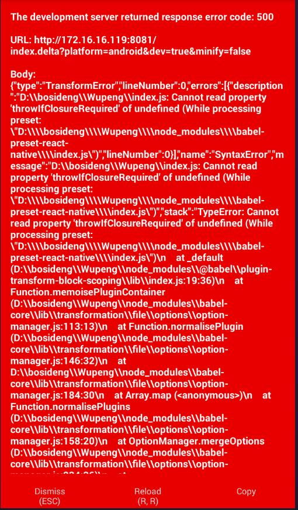
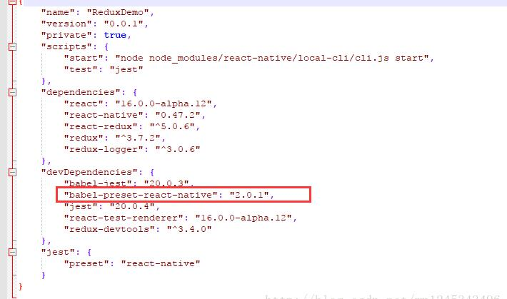
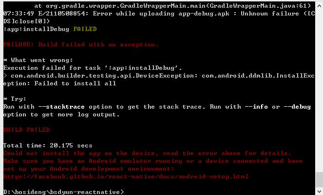
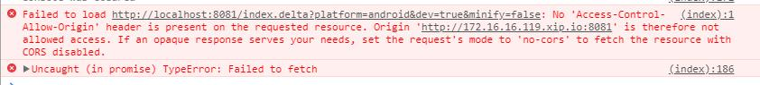

#React-native常见问题

##adb devices找不到设备
    
    ```
    找到你存放模拟器的设备 <例如：C:\Documents and Settings\
    如图所示

    
    在cmd上输入adb kill-server 然后重新拔插usb线之后，就可以连接adb 了。

    ```

##gradlew.bat assembleRelease --console plain

    React native打包出现unable to process incoming event 'ProcessComplete' <ProgressCompleteEvent>
    出现这种情况是因为代码混淆异常，分析问题后发现in library class Android.text.StaticLayout，这段问题是主要为，所以在混淆文件中加入：
    -keep class android.text {* ;}
    -dontwarn android.text.*
    上面的方法还是不行，找了找有一个可行的方法
    打包命令：
        gradlew.bat assembleRelease --console plain

##The development server returned response error code:500


        在运行ReactNative项目的时候，手机上经常会出现这种错误，解决办法： 
        在当前项目的路径下分别运行以下命令：
        npm uninstall babel-preset-react-native

        npm install babel-preset-react-native@2.1.0 —save
        如果你是用的yarn的话，需要将npm修改为yarn：
        在运行ReactNative项目的时候，手机上经常会出现这种错误，解决办法： 
        在当前项目的路径下分别运行以下命令：
        npm uninstall babel-preset-react-native

        npm install babel-preset-react-native@2.1.0 —save
        如果你是用的yarn的话，需要将npm修改为yarn：

##react-native设备太老连接不上



        react-native run-android –deviceId 设备名
##问题：跨域资源加载出错


        找到node_modules/metro模块，修改Server/index.js、index.js.flow文件，在_processDeltaRequest方法里加上下面代码。
        mres.setHeader("Access-Control-Allow-Origin", "*");
##修改server端口

        /node_modules/react-native/local-cli/server/server.js


